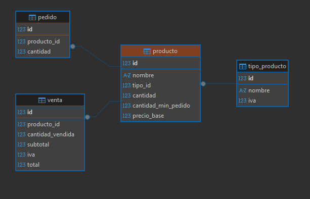

# Modelo DB



```sql

CREATE TABLE tipo_producto (
	id INT UNSIGNED PRIMARY KEY,
	nombre VARCHAR(128) NOT NULL,
	iva DECIMAL(20,6) NOT NULL
) ENGINE=InnoDB;

INSERT INTO tipo_producto (id, nombre, iva) VALUES (1, 'PAPELERIA', 16);
INSERT INTO tipo_producto (id, nombre, iva) VALUES (2, 'SUPERMERCADO', 4);
INSERT INTO tipo_producto (id, nombre, iva) VALUES (3, 'DROGUERIA', 12);

CREATE TABLE producto (
	id INT UNSIGNED AUTO_INCREMENT PRIMARY KEY,
	nombre VARCHAR(128) NOT NULL,
	tipo_id INT UNSIGNED NOT NULL,
	cantidad INT UNSIGNED NOT NULL,
	cantidad_min_pedido INT UNSIGNED NOT NULL,
	precio_base DECIMAL(20,6) NOT NULL,
	FOREIGN KEY (tipo_id) REFERENCES tipo_producto(id)
) ENGINE=InnoDB;

INSERT INTO producto (nombre, tipo_id, cantidad, cantidad_min_pedido, precio_base) 
VALUES ('Lápiz', 1, 0, 10, 1300);
INSERT INTO producto (nombre, tipo_id, cantidad, cantidad_min_pedido, precio_base) 
VALUES ('Borrador', 1, 0, 10, 600);
INSERT INTO producto (nombre, tipo_id, cantidad, cantidad_min_pedido, precio_base) 
VALUES ('Aspirina', 3, 0, 10, 900);
INSERT INTO producto (nombre, tipo_id, cantidad, cantidad_min_pedido, precio_base) 
VALUES ('Pan', 2, 0, 10, 400);


CREATE TABLE pedido (
	id INT UNSIGNED AUTO_INCREMENT PRIMARY KEY,
	producto_id INT UNSIGNED NOT NULL,
	cantidad INT UNSIGNED NOT NULL,
	FOREIGN KEY (producto_id) REFERENCES producto(id)
) ENGINE=InnoDB;

CREATE TABLE venta (
	id INT UNSIGNED AUTO_INCREMENT PRIMARY KEY,
	producto_id INT UNSIGNED NOT NULL,
	cantidad_vendida INT UNSIGNED NOT NULL,
	subtotal DECIMAL(20,6) NOT NULL,
	iva DECIMAL(20,6) NOT NULL,
	total DECIMAL(20,6) NOT NULL,
	FOREIGN KEY (producto_id) REFERENCES producto(id)
) ENGINE=InnoDB;

```
